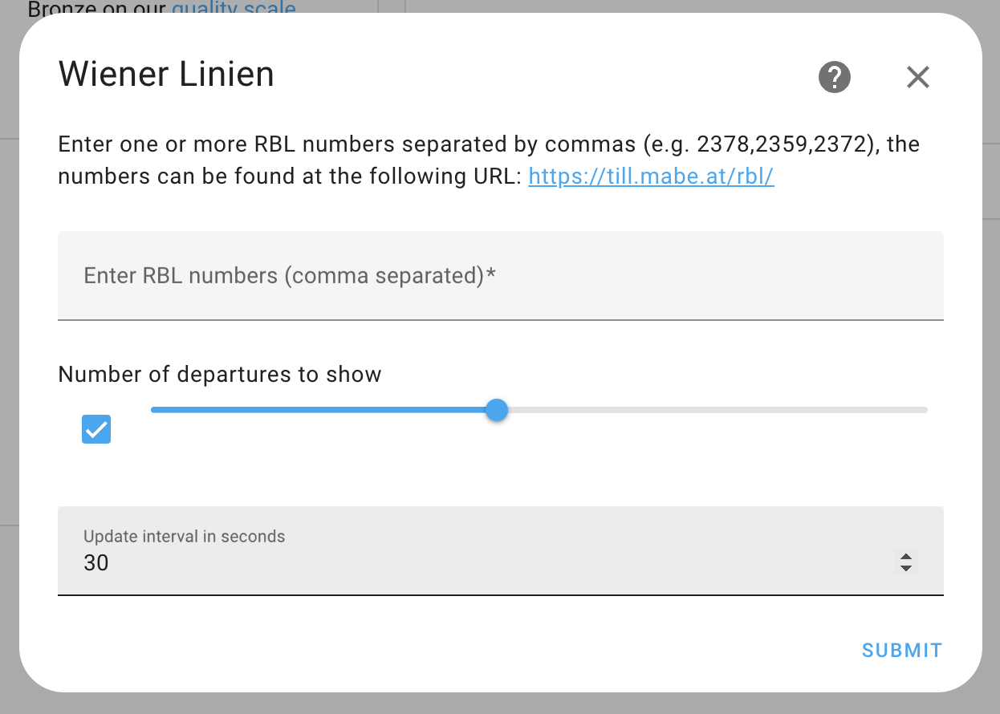
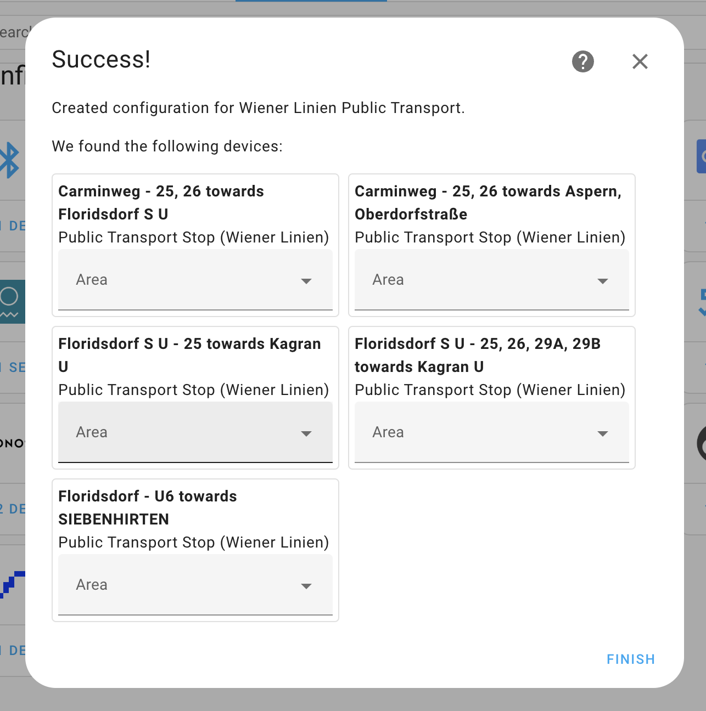
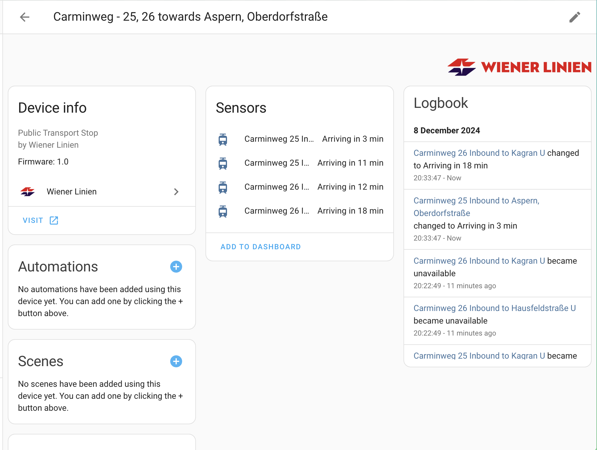
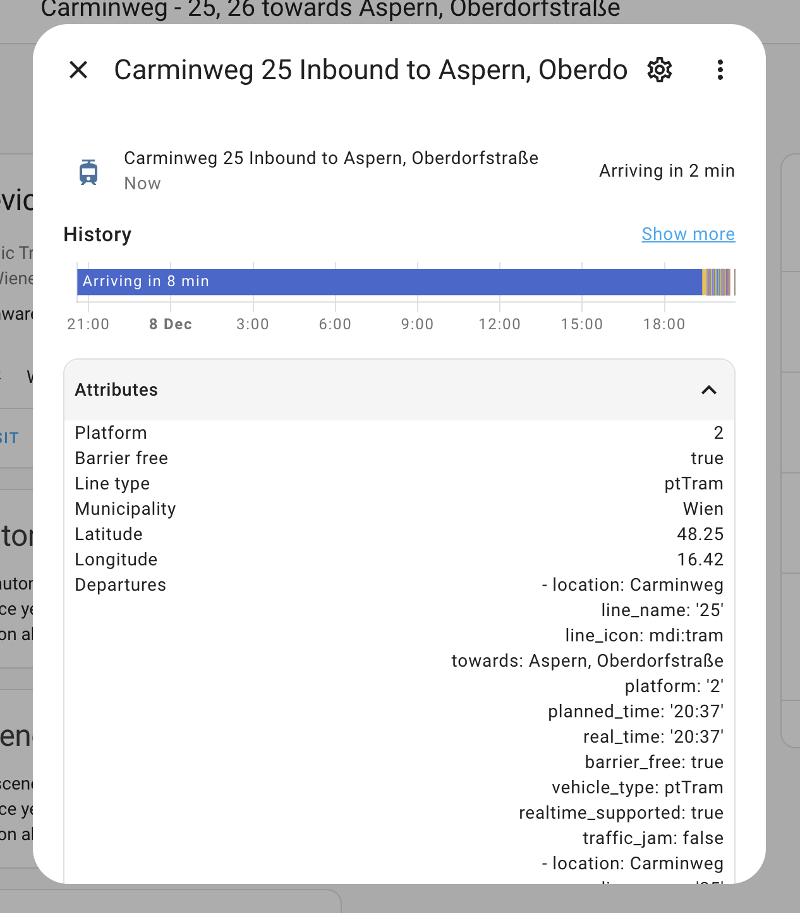
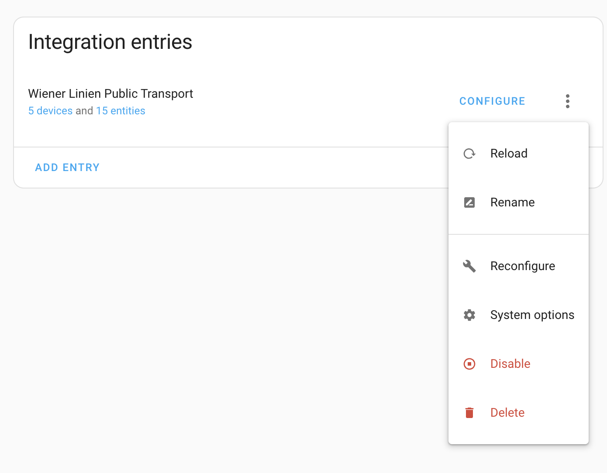
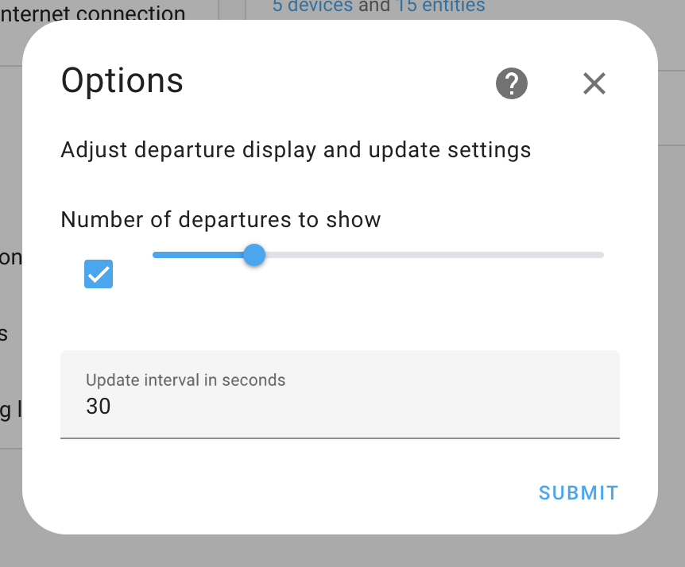
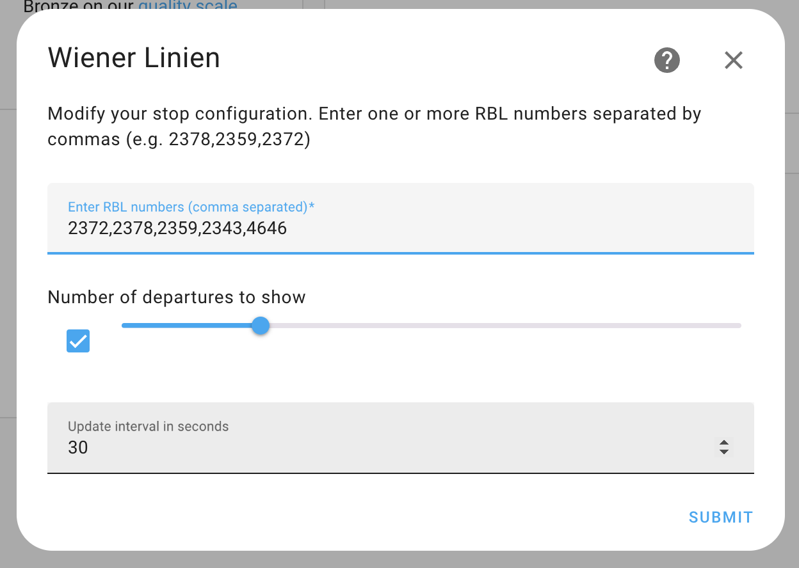

# wienerlinien

This integration was inspired originally by [home-assistant-wienerlinien](https://github.com/tofuSCHNITZEL/home-assistant-wienerlinien).

There are several differences here.

This updated integration is ONLY configurable via the UI.

All data is requested via a single API call for all stops, the update frequency for this is configurable with a default of 30 seconds.

The amount of departures is also configurable, up to a max of 10. Whether the stop itself has 10 departures available does not matter, the filtering is done after the data collection, and we always request all info available.

As with the integration that inspired this one, you should find the relevant stop ids (rbl numbers) from the following site resource: [Matthias Bendel](https://github.com/mabe-at) [https://till.mabe.at/rbl/](https://till.mabe.at/rbl/)

## Setup

Initial setup is straightforward and hopefully easy to follow.

Each rbl number added creates a new device with 1-n line sensors, as shown in the following images.

A given line monitor contains a list of departures, this departures list is updated based on the interval given in the config.

The integration supports both options flow and reconfigure flow.

The options flow supports modification of the departures list size, and the update interval.

The reconfigure flow supports modification of all cconfiguration settings, including adding/removing rbl numbers.

## Resources and Thanks

- [Matthias Bendel](https://github.com/mabe-at)

- [tofuSCHNITZEL](https://github.com/tofuSCHNITZEL)

- This platform is using the [Wienerlinien API](http://www.wienerlinien.at) API to get the information.
'Datenquelle: Stadt Wien – data.wien.gv.at'
Lizenz (CC BY 3.0 AT)